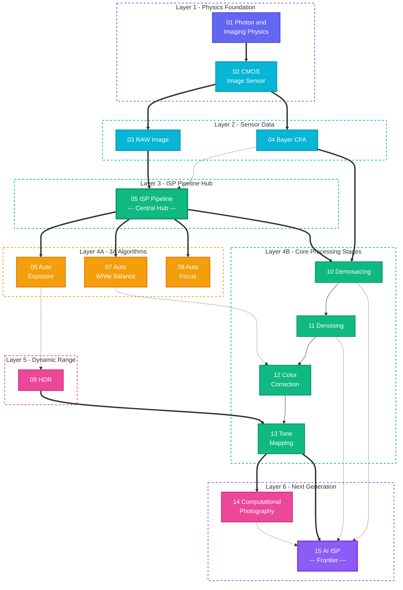

# Photon2Pixel-ISP
From Photon to Pixel.

Photon2Pixel is a long-term project for studying and implementing the complete imaging pipeline:

Photon
→ Optics
→ CMOS Sensor
→ RAW
→ ISP
→ Computational Photography
→ AI ISP
→ RGB Image
# ISP Learning Roadmap

> **From Photons to Pixels** - A comprehensive journey through the modern camera Image Signal Processing pipeline.

<p align="center">
  
  
  
</p>

---

## Roadmap Overview



### Connection Legend

| Line Style | Meaning |
| --- | --- |
| **Solid thick arrow** `==>` | Primary data flow |
| **Solid thin arrow** `-->` | Sequential processing |
| **Dashed arrow** `-.->` | Feedback / influence |

---

## Module Details

| #   | Module | Category | Description | Prerequisites |
| --- | --- | --- | --- | --- |
| 01  | **Photon & Imaging Physics** | Physics | Light properties, photoelectric effect, radiometry, imaging optics | -   |
| 02  | **CMOS Image Sensor** | Sensor | Pixel structure, photoelectric conversion, readout circuits, noise model | 01  |
| 03  | **RAW Image** | Sensor | Raw sensor data, bit depth, black level correction, linearization | 02  |
| 04  | **Bayer CFA** | Sensor | RGGB color filter array, spatial sampling, spectral aliasing | 02  |
| 05  | **ISP Pipeline** | Pipeline | Full signal processing chain: RAW to RGB to YUV | 03, 04 |
| 06  | **Auto Exposure** | 3A  | Exposure control strategy, histogram analysis, gain/shutter adjustment | 05  |
| 07  | **Auto White Balance** | 3A  | Color temperature estimation, gray world assumption, illuminant classification | 05  |
| 08  | **Auto Focus** | 3A  | Focus search algorithms, PDAF / CDAF, contrast detection | 05  |
| 09  | **HDR** | Advanced | Multi-frame exposure fusion, ghost removal, dynamic range extension | 06  |
| 10  | **Demosaicing** | Pipeline | Bayer interpolation to full-color image, edge-directed, false color suppression | 04, 05 |
| 11  | **Denoising** | Pipeline | Spatial / temporal denoising, BM3D, NLM, bilateral filtering | 10  |
| 12  | **Color Correction** | Pipeline | CCM color correction matrix, color space conversion, gamma correction | 07, 11 |
| 13  | **Tone Mapping** | Pipeline | Global / local tone mapping, Reinhard, ACES curve | 09, 12 |
| 14  | **Computational Photography** | Advanced | Super resolution, night mode, depth simulation, panorama stitching | 13  |
| 15  | **AI ISP** | AI  | End-to-end neural network ISP, learned demosaicing / denoising | 10, 11, 14 |

---

## Suggested Learning Path

```
Stage 1 - Foundations         01 -> 02 -> 03 -> 04
    Understand light, sensors, RAW data formats

Stage 2 - Core Pipeline       05 -> 10 -> 11 -> 12 -> 13
    Master the ISP chain: Demosaic -> Denoise -> CCM -> Tone Mapping

Stage 3 - 3A Control          06 -> 07 -> 08
    Learn auto exposure, white balance, and focus algorithms

Stage 4 - Advanced            09 -> 14
    HDR high dynamic range, computational photography

Stage 5 - Frontier            15
    AI-driven end-to-end image signal processing
```

---

<p align="center">
  <b>Star this repo if it helps your learning journey!</b><br/>
  <sub>Contributions welcome - Open an issue to suggest improvements</sub>
</p>
