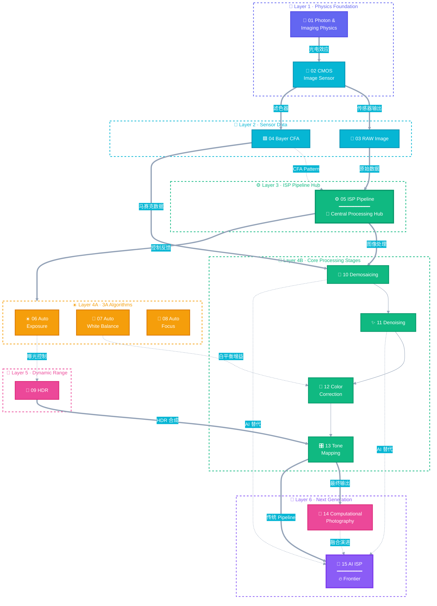

# Photon2Pixel-ISP
From Photon to Pixel.

Photon2Pixel is a long-term project for studying and implementing the complete imaging pipeline:

Photon
→ Optics
→ CMOS Sensor
→ RAW
→ ISP
→ Computational Photography
→ AI ISP
→ RGB Image

# 📷 ISP Learning Roadmap

> **From Photons to Pixels** — A comprehensive journey through the modern camera Image Signal Processing pipeline.

<p align="center">
  
  
  
</p>

---

## 🗺️ Roadmap Overview



---

## 📋 Module Details

| # | Module | Category | Description | Prerequisites |
|:---:|:---|:---:|:---|:---:|
| 01 | **Photon & Imaging Physics** | 🔬 Physics | 光子特性、光电效应、辐射度量学、成像光学基础 | — |
| 02 | **CMOS Image Sensor** | 📡 Sensor | 像素结构、光电转换、读出电路、噪声模型 | 01 |
| 03 | **RAW Image** | 📸 Sensor | 传感器原始数据、位深度、黑电平校正、线性化 | 02 |
| 04 | **Bayer CFA** | 🟩 Sensor | RGGB 色彩滤波阵列、空间采样、频谱混叠 | 02 |
| 05 | **ISP Pipeline** | ⚙️ Pipeline | 完整信号处理链路：RAW → RGB → YUV，串联所有模块 | 03, 04 |
| 06 | **Auto Exposure** | ☀️ 3A | 曝光控制策略、直方图分析、增益/快门调节 | 05 |
| 07 | **Auto White Balance** | 🎨 3A | 色温估计、灰世界假设、完美反射、光源分类 | 05 |
| 08 | **Auto Focus** | 🎯 3A | 对焦搜索算法、PDAF / CDAF、对比度检测 | 05 |
| 09 | **HDR** | 🌅 Advanced | 多帧曝光融合、Ghost 去除、动态范围扩展 | 06 |
| 10 | **Demosaicing** | 🧩 Pipeline | Bayer 插值重建全彩图像、边缘导向、伪彩抑制 | 04, 05 |
| 11 | **Denoising** | ✨ Pipeline | 空域 / 时域降噪、BM3D、NLM、双边滤波 | 10 |
| 12 | **Color Correction** | 🌈 Pipeline | CCM 色彩校正矩阵、色彩空间转换、Gamma 校正 | 07, 11 |
| 13 | **Tone Mapping** | 🎛️ Pipeline | 全局 / 局部色调映射、Reinhard、ACES 曲线 | 09, 12 |
| 14 | **Computational Photography** | 📐 Advanced | 超分辨率、夜景模式、景深模拟、全景拼接 | 13 |
| 15 | **AI ISP** | 🤖 AI | 端到端神经网络 ISP、learned demosaicing / denoising | 10, 11, 14 |

---

## 🛤️ Suggested Learning Path

```
 ╔══════════════════════════════════════════════════════════════╗
 ║                    🎓 LEARNING STAGES                        ║
 ╠══════════════════════════════════════════════════════════════╣
 ║                                                              ║
 ║  Stage 1 ·  Foundations        01 → 02 → 03 → 04             ║
 ║  ─────────────────────────────────────────────               ║
 ║  理解光的本质、传感器工作原理、RAW 数据格式                   ║
 ║                                                              ║
 ║  Stage 2 ·  Core Pipeline      05 → 10 → 11 → 12 → 13        ║
 ║  ─────────────────────────────────────────────               ║
 ║  掌握 ISP 主处理链路：去马赛克 → 降噪 → 色彩校正 → 色调映射   ║
 ║                                                              ║
 ║  Stage 3 ·  3A Control         06 → 07 → 08                  ║
 ║  ─────────────────────────────────────────────               ║
 ║  学习自动曝光、白平衡、对焦的控制算法                         ║
 ║                                                              ║
 ║  Stage 4 ·  Advanced           09 → 14                       ║
 ║  ─────────────────────────────────────────────               ║
 ║  HDR 高动态范围、计算摄影前沿技术                             ║
 ║                                                              ║
 ║  Stage 5 ·  Frontier           15                            ║
 ║  ─────────────────────────────────────────────               ║
 ║  AI 驱动的端到端图像信号处理                                  ║
 ║                                                              ║
 ╚══════════════════════════════════════════════════════════════╝
```

---

<p align="center">
  <b>⭐ Star this repo if it helps your learning journey!</b><br/>
  <sub>Contributions welcome · Open an issue to suggest improvements</sub>
</p>
