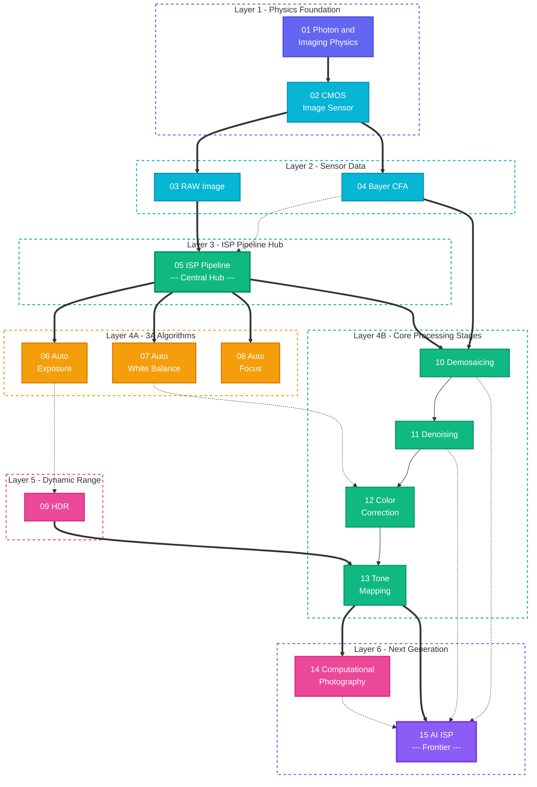

# Photon2Pixel-ISP
From Photon to Pixel.

Photon2Pixel is a long-term project for studying and implementing the complete imaging pipeline:

Photon
→ Optics
→ CMOS Sensor
→ RAW
→ ISP
→ Computational Photography
→ AI ISP
→ RGB Image


<!DOCTYPE html>
<html>
<head>
  <script src="https://www.gstatic.com/antigravity/web/dev/tailwindcss.min.js"></script>
  <style>
    /* Animated gradient background */
    @keyframes gradientShift {
      0% { background-position: 0% 50%; }
      50% { background-position: 100% 50%; }
      100% { background-position: 0% 50%; }
    }
    @keyframes float {
      0%, 100% { transform: translateY(0px); }
      50% { transform: translateY(-6px); }
    }
    @keyframes pulse-glow {
      0%, 100% { box-shadow: 0 0 8px rgba(99,102,241,0.3); }
      50% { box-shadow: 0 0 20px rgba(99,102,241,0.6); }
    }
    @keyframes dash {
      to { stroke-dashoffset: 0; }
    }
    @keyframes fadeInUp {
      from { opacity: 0; transform: translateY(30px); }
      to { opacity: 1; transform: translateY(0); }
    }
    @keyframes particleFloat {
      0% { transform: translateY(0) translateX(0) scale(1); opacity: 0.6; }
      50% { opacity: 1; }
      100% { transform: translateY(-800px) translateX(100px) scale(0); opacity: 0; }
    }

    .node {
      transition: all 0.3s cubic-bezier(0.4, 0, 0.2, 1);
      cursor: pointer;
      animation: fadeInUp 0.6s ease-out both;
    }
    .node:hover {
      transform: scale(1.05) translateY(-4px);
      z-index: 50;
    }
    .node:hover .node-card {
      box-shadow: 0 8px 32px rgba(99,102,241,0.35);
    }
    .node-card {
      transition: all 0.3s ease;
    }

    .connector-line {
      stroke-dasharray: 8 4;
      animation: dash 20s linear infinite;
    }

    .particle {
      position: absolute;
      width: 3px;
      height: 3px;
      border-radius: 50%;
      animation: particleFloat linear infinite;
      pointer-events: none;
    }

    .layer-label {
      writing-mode: vertical-rl;
      text-orientation: mixed;
      letter-spacing: 3px;
    }

    .tooltip {
      opacity: 0;
      pointer-events: none;
      transition: opacity 0.25s ease;
      position: absolute;
      z-index: 100;
    }
    .node:hover .tooltip {
      opacity: 1;
    }

    /* Category accent colors */
    .cat-physics { --cat: #6366f1; --cat-bg: rgba(99,102,241,0.12); --cat-border: rgba(99,102,241,0.35); }
    .cat-sensor { --cat: #06b6d4; --cat-bg: rgba(6,182,212,0.12); --cat-border: rgba(6,182,212,0.35); }
    .cat-3a { --cat: #f59e0b; --cat-bg: rgba(245,158,11,0.12); --cat-border: rgba(245,158,11,0.35); }
    .cat-pipeline { --cat: #10b981; --cat-bg: rgba(16,185,129,0.12); --cat-border: rgba(16,185,129,0.35); }
    .cat-advanced { --cat: #ec4899; --cat-bg: rgba(236,72,153,0.12); --cat-border: rgba(236,72,153,0.35); }
    .cat-ai { --cat: #8b5cf6; --cat-bg: rgba(139,92,246,0.12); --cat-border: rgba(139,92,246,0.35); }
  </style>
</head>
<body class="bg-[var(--background)] text-[var(--foreground)] antialiased p-0 m-0 overflow-x-hidden">

  <!-- Floating Particles Background -->
  <div id="particles" class="fixed inset-0 pointer-events-none overflow-hidden z-0"></div>

  <!-- Main Container -->
  <div class="relative z-10 max-w-6xl mx-auto px-6 py-10">

    <!-- Header -->
    <div class="text-center mb-12">
      <div class="inline-flex items-center gap-2 px-4 py-1.5 rounded-full text-xs font-semibold tracking-wider mb-4"
           style="background: linear-gradient(135deg, rgba(99,102,241,0.15), rgba(236,72,153,0.15)); color: #a78bfa; border: 1px solid rgba(139,92,246,0.25);">
        📷 IMAGE SIGNAL PROCESSING
      </div>
      <h1 class="text-4xl font-black tracking-tight mb-3" style="background: linear-gradient(135deg, #6366f1, #ec4899, #f59e0b); -webkit-background-clip: text; -webkit-text-fill-color: transparent; background-size: 200% 200%; animation: gradientShift 4s ease infinite;">
        ISP Learning Roadmap
      </h1>
      <p class="text-[var(--muted-foreground)] text-sm max-w-xl mx-auto leading-relaxed">
        From photons to pixels — a comprehensive journey through the modern camera image processing pipeline.
        <br>Click any module to explore its connections.
      </p>
    </div>

    <!-- Legend -->
    <div class="flex flex-wrap justify-center gap-4 mb-10 text-xs font-medium">
      <span class="flex items-center gap-1.5 cat-physics"><span class="w-3 h-3 rounded-full" style="background:#6366f1;"></span>Physics Foundation</span>
      <span class="flex items-center gap-1.5 cat-sensor"><span class="w-3 h-3 rounded-full" style="background:#06b6d4;"></span>Sensor & Capture</span>
      <span class="flex items-center gap-1.5 cat-3a"><span class="w-3 h-3 rounded-full" style="background:#f59e0b;"></span>3A Algorithms</span>
      <span class="flex items-center gap-1.5 cat-pipeline"><span class="w-3 h-3 rounded-full" style="background:#10b981;"></span>Core ISP Pipeline</span>
      <span class="flex items-center gap-1.5 cat-advanced"><span class="w-3 h-3 rounded-full" style="background:#ec4899;"></span>Advanced Techniques</span>
      <span class="flex items-center gap-1.5 cat-ai"><span class="w-3 h-3 rounded-full" style="background:#8b5cf6;"></span>AI & Computation</span>
    </div>

    <!-- SVG Connections Layer -->
    <svg id="connectors" class="absolute top-0 left-0 w-full h-full pointer-events-none z-0" style="overflow:visible;"></svg>

    <!-- ═══════════════════════════════════════ -->
    <!-- LAYER 1: Physics Foundation             -->
    <!-- ═══════════════════════════════════════ -->
    <div class="mb-3">
      <div class="flex items-center gap-2 mb-3 ml-1">
        <div class="w-1.5 h-6 rounded-full" style="background:#6366f1;"></div>
        <span class="text-xs font-bold tracking-widest uppercase" style="color:#6366f1;">Layer 1 · Physics Foundation</span>
      </div>
      <div class="grid grid-cols-2 gap-4" id="layer1">
        <!-- 01 Photon & Imaging Physics -->
        <div class="node cat-physics" data-id="photon" style="animation-delay: 0.05s;" onclick="highlightConnections('photon')">
          <div class="node-card relative rounded-xl p-4 border" style="background: var(--cat-bg); border-color: var(--cat-border);">
            <div class="flex items-start gap-3">
              <div class="text-2xl mt-0.5">🔬</div>
              <div class="flex-1 min-w-0">
                <div class="flex items-center gap-2 mb-1">
                  <span class="text-[10px] font-bold px-1.5 py-0.5 rounded" style="background: var(--cat-border); color: var(--cat);">01</span>
                  <h3 class="text-sm font-bold truncate">Photon & Imaging Physics</h3>
                </div>
                <p class="text-[var(--muted-foreground)] text-xs leading-relaxed">光子特性、光电效应、辐射度量学、成像光学基础</p>
              </div>
            </div>
            <div class="tooltip -top-12 left-1/2 -translate-x-1/2 bg-[var(--card)] border border-[var(--border)] rounded-lg px-3 py-2 text-xs shadow-xl w-56">
              The fundamental physics of how light interacts with matter and forms images.
            </div>
          </div>
        </div>
        <!-- 02 CMOS Image Sensor -->
        <div class="node cat-sensor" data-id="cmos" style="animation-delay: 0.1s;" onclick="highlightConnections('cmos')">
          <div class="node-card relative rounded-xl p-4 border" style="background: var(--cat-bg); border-color: var(--cat-border);">
            <div class="flex items-start gap-3">
              <div class="text-2xl mt-0.5">📡</div>
              <div class="flex-1 min-w-0">
                <div class="flex items-center gap-2 mb-1">
                  <span class="text-[10px] font-bold px-1.5 py-0.5 rounded" style="background: var(--cat-border); color: var(--cat);">02</span>
                  <h3 class="text-sm font-bold truncate">CMOS Image Sensor</h3>
                </div>
                <p class="text-[var(--muted-foreground)] text-xs leading-relaxed">像素结构、光电转换、读出电路、噪声模型</p>
              </div>
            </div>
          </div>
        </div>
      </div>
    </div>

    <!-- Arrow Divider -->
    <div class="flex justify-center my-2">
      <svg width="24" height="32" viewBox="0 0 24 32"><path d="M12 0 L12 24 M4 18 L12 28 L20 18" stroke="#6366f1" stroke-width="2" fill="none" opacity="0.5"/></svg>
    </div>

    <!-- ═══════════════════════════════════════ -->
    <!-- LAYER 2: Sensor Data                    -->
    <!-- ═══════════════════════════════════════ -->
    <div class="mb-3">
      <div class="flex items-center gap-2 mb-3 ml-1">
        <div class="w-1.5 h-6 rounded-full" style="background:#06b6d4;"></div>
        <span class="text-xs font-bold tracking-widest uppercase" style="color:#06b6d4;">Layer 2 · Sensor Data</span>
      </div>
      <div class="grid grid-cols-2 gap-4" id="layer2">
        <!-- 03 RAW Image -->
        <div class="node cat-sensor" data-id="raw" style="animation-delay: 0.15s;" onclick="highlightConnections('raw')">
          <div class="node-card relative rounded-xl p-4 border" style="background: var(--cat-bg); border-color: var(--cat-border);">
            <div class="flex items-start gap-3">
              <div class="text-2xl mt-0.5">📸</div>
              <div class="flex-1 min-w-0">
                <div class="flex items-center gap-2 mb-1">
                  <span class="text-[10px] font-bold px-1.5 py-0.5 rounded" style="background: var(--cat-border); color: var(--cat);">03</span>
                  <h3 class="text-sm font-bold truncate">RAW Image</h3>
                </div>
                <p class="text-[var(--muted-foreground)] text-xs leading-relaxed">传感器原始数据、位深度、黑电平、线性化</p>
              </div>
            </div>
          </div>
        </div>
        <!-- 04 Bayer CFA -->
        <div class="node cat-sensor" data-id="bayer" style="animation-delay: 0.2s;" onclick="highlightConnections('bayer')">
          <div class="node-card relative rounded-xl p-4 border" style="background: var(--cat-bg); border-color: var(--cat-border);">
            <div class="flex items-start gap-3">
              <div class="text-2xl mt-0.5">🟩</div>
              <div class="flex-1 min-w-0">
                <div class="flex items-center gap-2 mb-1">
                  <span class="text-[10px] font-bold px-1.5 py-0.5 rounded" style="background: var(--cat-border); color: var(--cat);">04</span>
                  <h3 class="text-sm font-bold truncate">Bayer CFA</h3>
                </div>
                <p class="text-[var(--muted-foreground)] text-xs leading-relaxed">RGGB 排列、色彩滤波阵列、空间采样</p>
              </div>
            </div>
          </div>
        </div>
      </div>
    </div>

    <!-- Arrow Divider -->
    <div class="flex justify-center my-2">
      <svg width="24" height="32" viewBox="0 0 24 32"><path d="M12 0 L12 24 M4 18 L12 28 L20 18" stroke="#06b6d4" stroke-width="2" fill="none" opacity="0.5"/></svg>
    </div>

    <!-- ═══════════════════════════════════════ -->
    <!-- LAYER 3: ISP Pipeline Hub               -->
    <!-- ═══════════════════════════════════════ -->
    <div class="mb-3">
      <div class="flex items-center gap-2 mb-3 ml-1">
        <div class="w-1.5 h-6 rounded-full" style="background:#10b981;"></div>
        <span class="text-xs font-bold tracking-widest uppercase" style="color:#10b981;">Layer 3 · ISP Pipeline Hub</span>
      </div>
      <div class="flex justify-center" id="layer3">
        <!-- 05 ISP Pipeline -->
        <div class="node cat-pipeline w-full max-w-xl" data-id="isp" style="animation-delay: 0.25s;" onclick="highlightConnections('isp')">
          <div class="node-card relative rounded-xl p-5 border-2" style="background: linear-gradient(135deg, rgba(16,185,129,0.1), rgba(6,182,212,0.08)); border-color: rgba(16,185,129,0.5); animation: pulse-glow 3s infinite;">
            <div class="flex items-center gap-4">
              <div class="text-3xl">⚙️</div>
              <div class="flex-1">
                <div class="flex items-center gap-2 mb-1">
                  <span class="text-[10px] font-bold px-1.5 py-0.5 rounded" style="background: rgba(16,185,129,0.35); color: #10b981;">05</span>
                  <h3 class="text-base font-black">ISP Pipeline</h3>
                  <span class="text-[10px] px-2 py-0.5 rounded-full font-semibold" style="background: rgba(16,185,129,0.2); color: #10b981;">CORE</span>
                </div>
                <p class="text-[var(--muted-foreground)] text-xs leading-relaxed">从 RAW → RGB → YUV 的完整信号处理链路，串联 3A 控制与图像增强模块</p>
              </div>
              <div class="text-[var(--muted-foreground)] text-lg">🔗</div>
            </div>
          </div>
        </div>
      </div>
    </div>

    <!-- Branching Arrow -->
    <div class="flex justify-center my-2">
      <svg width="200" height="36" viewBox="0 0 200 36">
        <path d="M100 0 L100 12 M30 36 L100 12 L170 36" stroke="#10b981" stroke-width="2" fill="none" opacity="0.5"/>
        <path d="M24 30 L30 36 L36 30" stroke="#f59e0b" stroke-width="2" fill="none" opacity="0.5"/>
        <path d="M164 30 L170 36 L176 30" stroke="#10b981" stroke-width="2" fill="none" opacity="0.5"/>
      </svg>
    </div>

    <!-- ═══════════════════════════════════════ -->
    <!-- LAYER 4: 3A Algorithms + Core Stages    -->
    <!-- ═══════════════════════════════════════ -->
    <div class="grid grid-cols-2 gap-6 mb-3">
      <!-- LEFT: 3A -->
      <div>
        <div class="flex items-center gap-2 mb-3 ml-1">
          <div class="w-1.5 h-6 rounded-full" style="background:#f59e0b;"></div>
          <span class="text-xs font-bold tracking-widest uppercase" style="color:#f59e0b;">3A Algorithms</span>
        </div>
        <div class="space-y-3" id="layer4a">
          <!-- 06 AE -->
          <div class="node cat-3a" data-id="ae" style="animation-delay: 0.3s;" onclick="highlightConnections('ae')">
            <div class="node-card relative rounded-xl p-3.5 border" style="background: var(--cat-bg); border-color: var(--cat-border);">
              <div class="flex items-center gap-3">
                <div class="text-xl">☀️</div>
                <div class="flex-1 min-w-0">
                  <div class="flex items-center gap-2 mb-0.5">
                    <span class="text-[10px] font-bold px-1.5 py-0.5 rounded" style="background: var(--cat-border); color: var(--cat);">06</span>
                    <h3 class="text-sm font-bold">Auto Exposure</h3>
                  </div>
                  <p class="text-[var(--muted-foreground)] text-[11px]">曝光控制、直方图分析、增益调节</p>
                </div>
              </div>
            </div>
          </div>
          <!-- 07 AWB -->
          <div class="node cat-3a" data-id="awb" style="animation-delay: 0.35s;" onclick="highlightConnections('awb')">
            <div class="node-card relative rounded-xl p-3.5 border" style="background: var(--cat-bg); border-color: var(--cat-border);">
              <div class="flex items-center gap-3">
                <div class="text-xl">🎨</div>
                <div class="flex-1 min-w-0">
                  <div class="flex items-center gap-2 mb-0.5">
                    <span class="text-[10px] font-bold px-1.5 py-0.5 rounded" style="background: var(--cat-border); color: var(--cat);">07</span>
                    <h3 class="text-sm font-bold">Auto White Balance</h3>
                  </div>
                  <p class="text-[var(--muted-foreground)] text-[11px]">色温估计、灰世界假设、光源分类</p>
                </div>
              </div>
            </div>
          </div>
          <!-- 08 AF -->
          <div class="node cat-3a" data-id="af" style="animation-delay: 0.4s;" onclick="highlightConnections('af')">
            <div class="node-card relative rounded-xl p-3.5 border" style="background: var(--cat-bg); border-color: var(--cat-border);">
              <div class="flex items-center gap-3">
                <div class="text-xl">🎯</div>
                <div class="flex-1 min-w-0">
                  <div class="flex items-center gap-2 mb-0.5">
                    <span class="text-[10px] font-bold px-1.5 py-0.5 rounded" style="background: var(--cat-border); color: var(--cat);">08</span>
                    <h3 class="text-sm font-bold">Auto Focus</h3>
                  </div>
                  <p class="text-[var(--muted-foreground)] text-[11px]">对焦算法、PDAF/CDAF、对比度检测</p>
                </div>
              </div>
            </div>
          </div>
        </div>
      </div>
      <!-- RIGHT: Core ISP Stages -->
      <div>
        <div class="flex items-center gap-2 mb-3 ml-1">
          <div class="w-1.5 h-6 rounded-full" style="background:#10b981;"></div>
          <span class="text-xs font-bold tracking-widest uppercase" style="color:#10b981;">Core Processing Stages</span>
        </div>
        <div class="space-y-3" id="layer4b">
          <!-- 10 Demosaicing -->
          <div class="node cat-pipeline" data-id="demosaic" style="animation-delay: 0.3s;" onclick="highlightConnections('demosaic')">
            <div class="node-card relative rounded-xl p-3.5 border" style="background: var(--cat-bg); border-color: var(--cat-border);">
              <div class="flex items-center gap-3">
                <div class="text-xl">🧩</div>
                <div class="flex-1 min-w-0">
                  <div class="flex items-center gap-2 mb-0.5">
                    <span class="text-[10px] font-bold px-1.5 py-0.5 rounded" style="background: var(--cat-border); color: var(--cat);">10</span>
                    <h3 class="text-sm font-bold">Demosaicing</h3>
                  </div>
                  <p class="text-[var(--muted-foreground)] text-[11px]">Bayer 插值、边缘导向、色彩伪影抑制</p>
                </div>
                <div class="text-[var(--muted-foreground)] text-lg">→</div>
              </div>
            </div>
          </div>
          <!-- 11 Denoising -->
          <div class="node cat-pipeline" data-id="denoise" style="animation-delay: 0.35s;" onclick="highlightConnections('denoise')">
            <div class="node-card relative rounded-xl p-3.5 border" style="background: var(--cat-bg); border-color: var(--cat-border);">
              <div class="flex items-center gap-3">
                <div class="text-xl">✨</div>
                <div class="flex-1 min-w-0">
                  <div class="flex items-center gap-2 mb-0.5">
                    <span class="text-[10px] font-bold px-1.5 py-0.5 rounded" style="background: var(--cat-border); color: var(--cat);">11</span>
                    <h3 class="text-sm font-bold">Denoising</h3>
                  </div>
                  <p class="text-[var(--muted-foreground)] text-[11px]">空域/时域降噪、BM3D、NLM</p>
                </div>
                <div class="text-[var(--muted-foreground)] text-lg">→</div>
              </div>
            </div>
          </div>
          <!-- 12 Color Correction -->
          <div class="node cat-pipeline" data-id="ccm" style="animation-delay: 0.4s;" onclick="highlightConnections('ccm')">
            <div class="node-card relative rounded-xl p-3.5 border" style="background: var(--cat-bg); border-color: var(--cat-border);">
              <div class="flex items-center gap-3">
                <div class="text-xl">🌈</div>
                <div class="flex-1 min-w-0">
                  <div class="flex items-center gap-2 mb-0.5">
                    <span class="text-[10px] font-bold px-1.5 py-0.5 rounded" style="background: var(--cat-border); color: var(--cat);">12</span>
                    <h3 class="text-sm font-bold">Color Correction</h3>
                  </div>
                  <p class="text-[var(--muted-foreground)] text-[11px]">CCM 矩阵、色彩空间转换、Gamma 校正</p>
                </div>
                <div class="text-[var(--muted-foreground)] text-lg">→</div>
              </div>
            </div>
          </div>
        </div>
      </div>
    </div>

    <!-- Merging Arrow -->
    <div class="flex justify-center my-2">
      <svg width="200" height="36" viewBox="0 0 200 36">
        <path d="M30 0 L100 24 L170 0" stroke="#10b981" stroke-width="2" fill="none" opacity="0.4"/>
        <path d="M100 24 L100 36" stroke="#10b981" stroke-width="2" fill="none" opacity="0.4"/>
        <path d="M94 30 L100 36 L106 30" stroke="#10b981" stroke-width="2" fill="none" opacity="0.5"/>
      </svg>
    </div>

    <!-- ═══════════════════════════════════════ -->
    <!-- LAYER 5: Tone Mapping + HDR             -->
    <!-- ═══════════════════════════════════════ -->
    <div class="mb-3">
      <div class="flex items-center gap-2 mb-3 ml-1">
        <div class="w-1.5 h-6 rounded-full" style="background:#ec4899;"></div>
        <span class="text-xs font-bold tracking-widest uppercase" style="color:#ec4899;">Layer 5 · Dynamic Range & Output</span>
      </div>
      <div class="grid grid-cols-2 gap-4" id="layer5">
        <!-- 09 HDR -->
        <div class="node cat-advanced" data-id="hdr" style="animation-delay: 0.45s;" onclick="highlightConnections('hdr')">
          <div class="node-card relative rounded-xl p-4 border" style="background: var(--cat-bg); border-color: var(--cat-border);">
            <div class="flex items-start gap-3">
              <div class="text-2xl mt-0.5">🌅</div>
              <div class="flex-1 min-w-0">
                <div class="flex items-center gap-2 mb-1">
                  <span class="text-[10px] font-bold px-1.5 py-0.5 rounded" style="background: var(--cat-border); color: var(--cat);">09</span>
                  <h3 class="text-sm font-bold truncate">HDR</h3>
                </div>
                <p class="text-[var(--muted-foreground)] text-xs leading-relaxed">多帧融合、曝光包围、Ghost 去除、动态范围扩展</p>
              </div>
            </div>
          </div>
        </div>
        <!-- 13 Tone Mapping -->
        <div class="node cat-pipeline" data-id="tonemap" style="animation-delay: 0.5s;" onclick="highlightConnections('tonemap')">
          <div class="node-card relative rounded-xl p-4 border" style="background: var(--cat-bg); border-color: var(--cat-border);">
            <div class="flex items-start gap-3">
              <div class="text-2xl mt-0.5">🎛️</div>
              <div class="flex-1 min-w-0">
                <div class="flex items-center gap-2 mb-1">
                  <span class="text-[10px] font-bold px-1.5 py-0.5 rounded" style="background: var(--cat-border); color: var(--cat);">13</span>
                  <h3 class="text-sm font-bold truncate">Tone Mapping</h3>
                </div>
                <p class="text-[var(--muted-foreground)] text-xs leading-relaxed">全局/局部色调映射、Reinhard、ACES 曲线</p>
              </div>
            </div>
          </div>
        </div>
      </div>
    </div>

    <!-- Arrow Divider -->
    <div class="flex justify-center my-2">
      <svg width="24" height="32" viewBox="0 0 24 32"><path d="M12 0 L12 24 M4 18 L12 28 L20 18" stroke="#ec4899" stroke-width="2" fill="none" opacity="0.5"/></svg>
    </div>

    <!-- ═══════════════════════════════════════ -->
    <!-- LAYER 6: Advanced & AI                  -->
    <!-- ═══════════════════════════════════════ -->
    <div class="mb-4">
      <div class="flex items-center gap-2 mb-3 ml-1">
        <div class="w-1.5 h-6 rounded-full" style="background: linear-gradient(180deg, #ec4899, #8b5cf6);"></div>
        <span class="text-xs font-bold tracking-widest uppercase" style="background: linear-gradient(90deg, #ec4899, #8b5cf6); -webkit-background-clip: text; -webkit-text-fill-color: transparent;">Layer 6 · Next Generation</span>
      </div>
      <div class="grid grid-cols-2 gap-4" id="layer6">
        <!-- 14 Computational Photography -->
        <div class="node cat-advanced" data-id="compphoto" style="animation-delay: 0.55s;" onclick="highlightConnections('compphoto')">
          <div class="node-card relative rounded-xl p-4 border" style="background: var(--cat-bg); border-color: var(--cat-border);">
            <div class="flex items-start gap-3">
              <div class="text-2xl mt-0.5">📐</div>
              <div class="flex-1 min-w-0">
                <div class="flex items-center gap-2 mb-1">
                  <span class="text-[10px] font-bold px-1.5 py-0.5 rounded" style="background: var(--cat-border); color: var(--cat);">14</span>
                  <h3 class="text-sm font-bold truncate">Computational Photography</h3>
                </div>
                <p class="text-[var(--muted-foreground)] text-xs leading-relaxed">超分辨率、夜景模式、景深模拟、全景拼接</p>
              </div>
            </div>
          </div>
        </div>
        <!-- 15 AI ISP -->
        <div class="node cat-ai" data-id="aiisp" style="animation-delay: 0.6s;" onclick="highlightConnections('aiisp')">
          <div class="node-card relative rounded-xl p-4 border-2" style="background: linear-gradient(135deg, rgba(139,92,246,0.12), rgba(236,72,153,0.08)); border-color: rgba(139,92,246,0.5);">
            <div class="flex items-start gap-3">
              <div class="text-2xl mt-0.5">🤖</div>
              <div class="flex-1 min-w-0">
                <div class="flex items-center gap-2 mb-1">
                  <span class="text-[10px] font-bold px-1.5 py-0.5 rounded" style="background: rgba(139,92,246,0.35); color: #8b5cf6;">15</span>
                  <h3 class="text-sm font-bold truncate">AI ISP</h3>
                  <span class="text-[10px] px-2 py-0.5 rounded-full font-semibold" style="background: rgba(139,92,246,0.2); color: #8b5cf6;">🔥 FRONTIER</span>
                </div>
                <p class="text-[var(--muted-foreground)] text-xs leading-relaxed">端到端神经网络 ISP、learned demosaicing & denoising</p>
              </div>
            </div>
          </div>
        </div>
      </div>
    </div>

    <!-- ═══════════════════════════════════════ -->
    <!-- Dependency Graph (interactive)          -->
    <!-- ═══════════════════════════════════════ -->
    <div class="mt-10 bg-[var(--card)] border border-[var(--border)] rounded-xl p-6 shadow-sm">
      <h2 class="text-lg font-bold mb-1">📊 Module Dependency Graph</h2>
      <p class="text-[var(--muted-foreground)] text-xs mb-4">Hover over any module above to see its dependencies highlighted below.</p>
      <div class="overflow-x-auto">
        <svg id="depGraph" width="100%" viewBox="0 0 860 360" style="min-width: 700px;">
          <!-- Background grid -->
          <defs>
            <pattern id="grid" width="20" height="20" patternUnits="userSpaceOnUse">
              <path d="M 20 0 L 0 0 0 20" fill="none" stroke="currentColor" stroke-width="0.3" opacity="0.08"/>
            </pattern>
            <marker id="arrowhead" markerWidth="8" markerHeight="6" refX="8" refY="3" orient="auto">
              <polygon points="0 0, 8 3, 0 6" fill="#6366f1" opacity="0.6"/>
            </marker>
            <marker id="arrowhead-active" markerWidth="8" markerHeight="6" refX="8" refY="3" orient="auto">
              <polygon points="0 0, 8 3, 0 6" fill="#f59e0b"/>
            </marker>
          </defs>
          <rect width="860" height="360" fill="url(#grid)"/>

          <!-- Edges (drawn first, behind nodes) -->
          <g id="edges">
            <!-- Photon → CMOS -->
            <line class="dep-edge" data-from="photon" data-to="cmos" x1="110" y1="40" x2="230" y2="40" stroke="#6366f1" stroke-width="1.5" opacity="0.25" marker-end="url(#arrowhead)"/>
            <!-- CMOS → RAW -->
            <line class="dep-edge" data-from="cmos" data-to="raw" x1="280" y1="60" x2="280" y2="100" stroke="#06b6d4" stroke-width="1.5" opacity="0.25" marker-end="url(#arrowhead)"/>
            <!-- CMOS → Bayer -->
            <line class="dep-edge" data-from="cmos" data-to="bayer" x1="330" y1="40" x2="390" y2="40" stroke="#06b6d4" stroke-width="1.5" opacity="0.25" marker-end="url(#arrowhead)"/>
            <!-- Bayer → Demosaic -->
            <line class="dep-edge" data-from="bayer" data-to="demosaic" x1="440" y1="60" x2="440" y2="155" stroke="#10b981" stroke-width="1.5" opacity="0.25" marker-end="url(#arrowhead)"/>
            <!-- RAW → ISP -->
            <line class="dep-edge" data-from="raw" data-to="isp" x1="280" y1="140" x2="280" y2="155" stroke="#10b981" stroke-width="1.5" opacity="0.25" marker-end="url(#arrowhead)"/>
            <!-- ISP → AE -->
            <line class="dep-edge" data-from="isp" data-to="ae" x1="160" y1="190" x2="110" y2="230" stroke="#f59e0b" stroke-width="1.5" opacity="0.25" marker-end="url(#arrowhead)"/>
            <!-- ISP → AWB -->
            <line class="dep-edge" data-from="isp" data-to="awb" x1="220" y1="190" x2="220" y2="230" stroke="#f59e0b" stroke-width="1.5" opacity="0.25" marker-end="url(#arrowhead)"/>
            <!-- ISP → AF -->
            <line class="dep-edge" data-from="isp" data-to="af" x1="280" y1="190" x2="330" y2="230" stroke="#f59e0b" stroke-width="1.5" opacity="0.25" marker-end="url(#arrowhead)"/>
            <!-- ISP → Demosaic -->
            <line class="dep-edge" data-from="isp" data-to="demosaic" x1="380" y1="175" x2="420" y2="175" stroke="#10b981" stroke-width="1.5" opacity="0.25" marker-end="url(#arrowhead)"/>
            <!-- Demosaic → Denoise -->
            <line class="dep-edge" data-from="demosaic" data-to="denoise" x1="510" y1="175" x2="540" y2="175" stroke="#10b981" stroke-width="1.5" opacity="0.25" marker-end="url(#arrowhead)"/>
            <!-- Denoise → CCM -->
            <line class="dep-edge" data-from="denoise" data-to="ccm" x1="630" y1="175" x2="660" y2="175" stroke="#10b981" stroke-width="1.5" opacity="0.25" marker-end="url(#arrowhead)"/>
            <!-- CCM → ToneMap -->
            <line class="dep-edge" data-from="ccm" data-to="tonemap" x1="740" y1="175" x2="770" y2="175" stroke="#10b981" stroke-width="1.5" opacity="0.25" marker-end="url(#arrowhead)"/>
            <!-- AE → HDR -->
            <line class="dep-edge" data-from="ae" data-to="hdr" x1="110" y1="270" x2="110" y2="310" stroke="#ec4899" stroke-width="1.5" opacity="0.25" marker-end="url(#arrowhead)"/>
            <!-- HDR → ToneMap -->
            <line class="dep-edge" data-from="hdr" data-to="tonemap" x1="160" y1="330" x2="780" y2="210" stroke="#ec4899" stroke-width="1.5" opacity="0.25" marker-end="url(#arrowhead)"/>
            <!-- AWB → CCM -->
            <line class="dep-edge" data-from="awb" data-to="ccm" x1="260" y1="250" x2="680" y2="190" stroke="#f59e0b" stroke-width="1.5" opacity="0.25" marker-end="url(#arrowhead)" stroke-dasharray="4 3"/>
            <!-- All core → CompPhoto -->
            <line class="dep-edge" data-from="tonemap" data-to="compphoto" x1="810" y1="195" x2="810" y2="280" stroke="#ec4899" stroke-width="1.5" opacity="0.25" marker-end="url(#arrowhead)"/>
            <!-- All → AI ISP -->
            <line class="dep-edge" data-from="denoise" data-to="aiisp" x1="590" y1="195" x2="660" y2="290" stroke="#8b5cf6" stroke-width="1.5" opacity="0.25" marker-end="url(#arrowhead)" stroke-dasharray="4 3"/>
            <line class="dep-edge" data-from="demosaic" data-to="aiisp" x1="470" y1="195" x2="650" y2="290" stroke="#8b5cf6" stroke-width="1.5" opacity="0.25" marker-end="url(#arrowhead)" stroke-dasharray="4 3"/>
            <line class="dep-edge" data-from="compphoto" data-to="aiisp" x1="790" y1="310" x2="730" y2="310" stroke="#8b5cf6" stroke-width="1.5" opacity="0.25" marker-end="url(#arrowhead)" stroke-dasharray="4 3"/>
          </g>

          <!-- Nodes -->
          <g id="graphNodes">
            <!-- Row 1: Foundation -->
            <g class="graph-node" data-id="photon" cursor="pointer">
              <rect x="20" y="20" width="90" height="40" rx="8" fill="#6366f1" fill-opacity="0.15" stroke="#6366f1" stroke-width="1.5"/>
              <text x="65" y="44" text-anchor="middle" fill="#6366f1" font-size="10" font-weight="700">01 Photon</text>
            </g>
            <g class="graph-node" data-id="cmos" cursor="pointer">
              <rect x="230" y="20" width="100" height="40" rx="8" fill="#06b6d4" fill-opacity="0.15" stroke="#06b6d4" stroke-width="1.5"/>
              <text x="280" y="44" text-anchor="middle" fill="#06b6d4" font-size="10" font-weight="700">02 CMOS</text>
            </g>
            <g class="graph-node" data-id="bayer" cursor="pointer">
              <rect x="390" y="20" width="100" height="40" rx="8" fill="#06b6d4" fill-opacity="0.15" stroke="#06b6d4" stroke-width="1.5"/>
              <text x="440" y="44" text-anchor="middle" fill="#06b6d4" font-size="10" font-weight="700">04 Bayer CFA</text>
            </g>

            <!-- Row 2: RAW + ISP -->
            <g class="graph-node" data-id="raw" cursor="pointer">
              <rect x="230" y="100" width="100" height="40" rx="8" fill="#06b6d4" fill-opacity="0.15" stroke="#06b6d4" stroke-width="1.5"/>
              <text x="280" y="124" text-anchor="middle" fill="#06b6d4" font-size="10" font-weight="700">03 RAW Image</text>
            </g>
            <g class="graph-node" data-id="isp" cursor="pointer">
              <rect x="150" y="155" width="230" height="40" rx="8" fill="#10b981" fill-opacity="0.2" stroke="#10b981" stroke-width="2"/>
              <text x="265" y="179" text-anchor="middle" fill="#10b981" font-size="12" font-weight="900">05 ISP Pipeline ⚙️</text>
            </g>

            <!-- Row 3: 3A -->
            <g class="graph-node" data-id="ae" cursor="pointer">
              <rect x="50" y="230" width="120" height="40" rx="8" fill="#f59e0b" fill-opacity="0.15" stroke="#f59e0b" stroke-width="1.5"/>
              <text x="110" y="254" text-anchor="middle" fill="#f59e0b" font-size="10" font-weight="700">06 Auto Exposure</text>
            </g>
            <g class="graph-node" data-id="awb" cursor="pointer">
              <rect x="180" y="230" width="80" height="40" rx="8" fill="#f59e0b" fill-opacity="0.15" stroke="#f59e0b" stroke-width="1.5"/>
              <text x="220" y="254" text-anchor="middle" fill="#f59e0b" font-size="10" font-weight="700">07 AWB</text>
            </g>
            <g class="graph-node" data-id="af" cursor="pointer">
              <rect x="270" y="230" width="120" height="40" rx="8" fill="#f59e0b" fill-opacity="0.15" stroke="#f59e0b" stroke-width="1.5"/>
              <text x="330" y="254" text-anchor="middle" fill="#f59e0b" font-size="10" font-weight="700">08 Auto Focus</text>
            </g>

            <!-- Row 3: Core pipeline (right side) -->
            <g class="graph-node" data-id="demosaic" cursor="pointer">
              <rect x="420" y="155" width="90" height="40" rx="8" fill="#10b981" fill-opacity="0.15" stroke="#10b981" stroke-width="1.5"/>
              <text x="465" y="179" text-anchor="middle" fill="#10b981" font-size="10" font-weight="700">10 Demosaic</text>
            </g>
            <g class="graph-node" data-id="denoise" cursor="pointer">
              <rect x="540" y="155" width="90" height="40" rx="8" fill="#10b981" fill-opacity="0.15" stroke="#10b981" stroke-width="1.5"/>
              <text x="585" y="179" text-anchor="middle" fill="#10b981" font-size="10" font-weight="700">11 Denoise</text>
            </g>
            <g class="graph-node" data-id="ccm" cursor="pointer">
              <rect x="660" y="155" width="80" height="40" rx="8" fill="#10b981" fill-opacity="0.15" stroke="#10b981" stroke-width="1.5"/>
              <text x="700" y="179" text-anchor="middle" fill="#10b981" font-size="10" font-weight="700">12 CCM</text>
            </g>
            <g class="graph-node" data-id="tonemap" cursor="pointer">
              <rect x="770" y="155" width="80" height="40" rx="8" fill="#10b981" fill-opacity="0.15" stroke="#10b981" stroke-width="1.5"/>
              <text x="810" y="179" text-anchor="middle" fill="#10b981" font-size="10" font-weight="700">13 Tonemap</text>
            </g>

            <!-- Row 4: HDR -->
            <g class="graph-node" data-id="hdr" cursor="pointer">
              <rect x="50" y="310" width="120" height="40" rx="8" fill="#ec4899" fill-opacity="0.15" stroke="#ec4899" stroke-width="1.5"/>
              <text x="110" y="334" text-anchor="middle" fill="#ec4899" font-size="10" font-weight="700">09 HDR</text>
            </g>

            <!-- Row 5: Advanced -->
            <g class="graph-node" data-id="compphoto" cursor="pointer">
              <rect x="740" y="280" width="140" height="40" rx="8" fill="#ec4899" fill-opacity="0.15" stroke="#ec4899" stroke-width="1.5"/>
              <text x="810" y="304" text-anchor="middle" fill="#ec4899" font-size="10" font-weight="700">14 Comp. Photo</text>
            </g>
            <g class="graph-node" data-id="aiisp" cursor="pointer">
              <rect x="610" y="290" width="120" height="40" rx="8" fill="#8b5cf6" fill-opacity="0.2" stroke="#8b5cf6" stroke-width="2"/>
              <text x="670" y="314" text-anchor="middle" fill="#8b5cf6" font-size="11" font-weight="900">15 AI ISP 🤖</text>
            </g>
          </g>
        </svg>
      </div>
    </div>

    <!-- Footer -->
    <div class="mt-8 text-center text-[var(--muted-foreground)] text-xs">
      <p>Built with ❤️ for the ISP community · <span style="color:#6366f1;">Star ⭐ if this helps your learning journey!</span></p>
    </div>
  </div>

  <script>
    // Particle system
    const particleContainer = document.getElementById('particles');
    const colors = ['#6366f1','#06b6d4','#10b981','#f59e0b','#ec4899','#8b5cf6'];
    function createParticle() {
      const p = document.createElement('div');
      p.className = 'particle';
      p.style.left = Math.random() * 100 + '%';
      p.style.top = '100%';
      p.style.background = colors[Math.floor(Math.random() * colors.length)];
      p.style.animationDuration = (8 + Math.random() * 12) + 's';
      p.style.animationDelay = Math.random() * 5 + 's';
      p.style.width = (2 + Math.random() * 3) + 'px';
      p.style.height = p.style.width;
      particleContainer.appendChild(p);
      setTimeout(() => p.remove(), 25000);
    }
    setInterval(createParticle, 400);
    for(let i=0; i<15; i++) setTimeout(createParticle, i*200);

    // Connection highlighting
    function highlightConnections(nodeId) {
      // Reset all edges
      document.querySelectorAll('.dep-edge').forEach(e => {
        e.setAttribute('opacity', '0.12');
        e.setAttribute('stroke-width', '1');
      });
      // Reset all graph nodes
      document.querySelectorAll('.graph-node rect').forEach(r => {
        r.setAttribute('fill-opacity', '0.08');
        r.setAttribute('stroke-width', '1');
      });
      // Highlight connected edges
      document.querySelectorAll(`.dep-edge[data-from="${nodeId}"], .dep-edge[data-to="${nodeId}"]`).forEach(e => {
        e.setAttribute('opacity', '0.9');
        e.setAttribute('stroke-width', '2.5');
        // Highlight connected nodes
        const from = e.getAttribute('data-from');
        const to = e.getAttribute('data-to');
        [from, to].forEach(id => {
          const node = document.querySelector(`.graph-node[data-id="${id}"] rect`);
          if(node) {
            node.setAttribute('fill-opacity', '0.3');
            node.setAttribute('stroke-width', '2.5');
          }
        });
      });
      // Always highlight self
      const selfNode = document.querySelector(`.graph-node[data-id="${nodeId}"] rect`);
      if(selfNode) {
        selfNode.setAttribute('fill-opacity', '0.4');
        selfNode.setAttribute('stroke-width', '3');
      }
    }

    // Graph node click highlighting
    document.querySelectorAll('.graph-node').forEach(node => {
      node.addEventListener('click', () => {
        highlightConnections(node.getAttribute('data-id'));
      });
    });

    // Reset on background click
    document.addEventListener('click', (e) => {
      if(!e.target.closest('.node') && !e.target.closest('.graph-node')) {
        document.querySelectorAll('.dep-edge').forEach(e => {
          e.setAttribute('opacity', '0.25');
          e.setAttribute('stroke-width', '1.5');
        });
        document.querySelectorAll('.graph-node rect').forEach(r => {
          r.setAttribute('fill-opacity', '0.15');
          r.setAttribute('stroke-width', '1.5');
        });
      }
    });
  </script>
</body>
</html>


# ISP Learning Roadmap

> **From Photons to Pixels** - A comprehensive journey through the modern camera Image Signal Processing pipeline.

<p align="center">
  
  
  
</p>

---

## Roadmap Overview



### Connection Legend

| Line Style | Meaning |
| --- | --- |
| **Solid thick arrow** `==>` | Primary data flow |
| **Solid thin arrow** `-->` | Sequential processing |
| **Dashed arrow** `-.->` | Feedback / influence |

---

## Module Details

| #   | Module | Category | Description | Prerequisites |
| --- | --- | --- | --- | --- |
| 01  | **Photon & Imaging Physics** | Physics | Light properties, photoelectric effect, radiometry, imaging optics | -   |
| 02  | **CMOS Image Sensor** | Sensor | Pixel structure, photoelectric conversion, readout circuits, noise model | 01  |
| 03  | **RAW Image** | Sensor | Raw sensor data, bit depth, black level correction, linearization | 02  |
| 04  | **Bayer CFA** | Sensor | RGGB color filter array, spatial sampling, spectral aliasing | 02  |
| 05  | **ISP Pipeline** | Pipeline | Full signal processing chain: RAW to RGB to YUV | 03, 04 |
| 06  | **Auto Exposure** | 3A  | Exposure control strategy, histogram analysis, gain/shutter adjustment | 05  |
| 07  | **Auto White Balance** | 3A  | Color temperature estimation, gray world assumption, illuminant classification | 05  |
| 08  | **Auto Focus** | 3A  | Focus search algorithms, PDAF / CDAF, contrast detection | 05  |
| 09  | **HDR** | Advanced | Multi-frame exposure fusion, ghost removal, dynamic range extension | 06  |
| 10  | **Demosaicing** | Pipeline | Bayer interpolation to full-color image, edge-directed, false color suppression | 04, 05 |
| 11  | **Denoising** | Pipeline | Spatial / temporal denoising, BM3D, NLM, bilateral filtering | 10  |
| 12  | **Color Correction** | Pipeline | CCM color correction matrix, color space conversion, gamma correction | 07, 11 |
| 13  | **Tone Mapping** | Pipeline | Global / local tone mapping, Reinhard, ACES curve | 09, 12 |
| 14  | **Computational Photography** | Advanced | Super resolution, night mode, depth simulation, panorama stitching | 13  |
| 15  | **AI ISP** | AI  | End-to-end neural network ISP, learned demosaicing / denoising | 10, 11, 14 |

---

## Suggested Learning Path

```
Stage 1 - Foundations         01 -> 02 -> 03 -> 04
    Understand light, sensors, RAW data formats

Stage 2 - Core Pipeline       05 -> 10 -> 11 -> 12 -> 13
    Master the ISP chain: Demosaic -> Denoise -> CCM -> Tone Mapping

Stage 3 - 3A Control          06 -> 07 -> 08
    Learn auto exposure, white balance, and focus algorithms

Stage 4 - Advanced            09 -> 14
    HDR high dynamic range, computational photography

Stage 5 - Frontier            15
    AI-driven end-to-end image signal processing
```

---

<p align="center">
  <b>Star this repo if it helps your learning journey!</b><br/>
  <sub>Contributions welcome - Open an issue to suggest improvements</sub>
</p>
